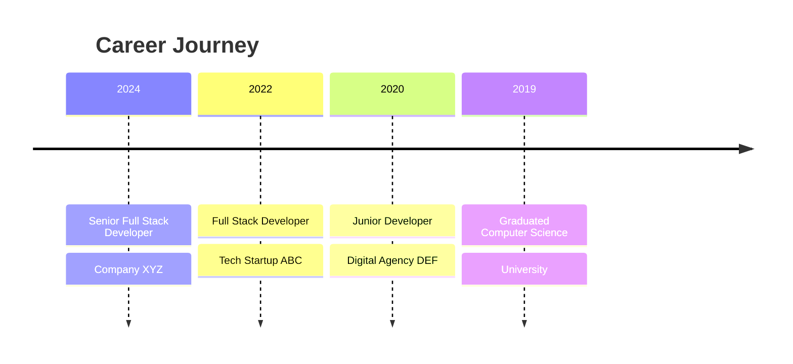

<div align="center">

# 👋 Hi, I'm [Your Name]


<p align="center">
  <a href="https://twitter.com/yourusername"></a>
  <a href="https://linkedin.com/in/yourusername"></a>
  <a href="https://yourwebsite.com"></a>
  <a href="mailto:your.email@example.com"></a>
</p>

</div>

---

## 🚀 About Me

```typescript
const developer = {
    name: "Your Name",
    location: "Your City, Country",
    role: "Full Stack Developer",
    languages: ["TypeScript", "Python", "Go", "Rust"],
    interests: ["AI/ML", "Web3", "Cloud Architecture", "Open Source"],
    currentFocus: "Building scalable systems and exploring AI",
    funFact: "I debug with console.log and I'm proud of it 🐛"
};
```

- 🔭 Currently working on **exciting AI-powered projects**
- 🌱 Learning **Rust** and **System Design**
- 💡 Open to collaborate on **innovative open source projects**
- ⚡ Fun fact: **Coffee is my debugging tool**

---

## 🛠️ Tech Stack

<div align="center">

### Languages


### Frontend


### Backend


### Database & Cloud


### AI & ML


</div>

---

## 📊 GitHub Stats

<div align="center">
  
  
</div>

<div align="center">
  
</div>

---

## 📈 Contribution Graph & Activity

<div align="center">
  
### 🔥 Contributions in the Last Year
  


</div>

<div align="center">

### 📅 Detailed Contribution Stats


</div>

<div align="center">

| 📊 Metric | 📈 Stats |
|-----------|----------|
| **Total Contributions** |  |
| **Current Streak** |  |
| **Public Repos** |  |
| **Followers** |  |

</div>

---

## 🏆 GitHub Trophies

<div align="center">
  
</div>

---

## 🌟 Featured Projects

<div align="center">

<a href="https://github.com/yourusername/project1">
  
</a>

<a href="https://github.com/yourusername/project2">
  
</a>

<a href="https://github.com/yourusername/project3">
  
</a>

<a href="https://github.com/yourusername/project4">
  
</a>

</div>

---

## 📝 Latest Blog Posts

<!-- BLOG-POST-LIST:START -->
- [Building Scalable Microservices with Go](https://yourblog.com/post1)
- [Understanding React Server Components](https://yourblog.com/post2)
- [AI-Powered Code Review: The Future of Development](https://yourblog.com/post3)
- [Deep Dive into WebAssembly](https://yourblog.com/post4)
<!-- BLOG-POST-LIST:END -->

---

## 🏢 Organizations & Collaborations

<div align="center">

[](https://github.com/Hz-Knowledge-Library)
[](https://github.com/Quantum-Transport-Computing)
[](https://github.com/NoosphereHub)
[](https://github.com/APINN-lab)
[](https://github.com/amair-lab)

</div>

---

## 💼 Work Experience & Recent Activity

<table>
<tr>
<td width="50%">

### 🎯 Career Timeline



</td>
<td width="50%">

### 📍 Recent Activity

<!-- RECENT-ACTIVITY:START -->
- 🎉 Contributed to **Hz-Knowledge-Library/Machine-Learning-Basic**
- 🔧 Worked on **brans-t/brans-t.github.io**
- 🚀 Contributed to **amair-lab/MOF-discovery**
- 👥 Joined **Hz Knowledge Library** organization
- 🌟 Joined **Quantum Transport Computing** organization
- 💡 Joined **NoosphereHub** organization
- ⚡ And **24+ other repositories**
<!-- RECENT-ACTIVITY:END -->

</td>
</tr>
</table>

---

## 🎯 Current Goals for 2024

- ✅ Contribute to 10+ open source projects
- 🔄 Launch my own SaaS product
- 📚 Write 24 technical blog posts
- 🎓 Master system design and cloud architecture
- 🤝 Mentor 5 junior developers

---

## 📈 Contribution Graph

<div align="center">
  
</div>

---

## 🎨 Skills Visualization

```text
TypeScript   ████████████████████░   95%
React        ███████████████████░░   90%
Python       ██████████████████░░░   85%
Node.js      ██████████████████░░░   85%
AWS          ████████████████░░░░░   80%
Docker       ███████████████░░░░░░   75%
Go           ██████████████░░░░░░░   70%
Rust         ████████░░░░░░░░░░░░░   40%
```

---

## 🤝 Open Source Contributions

<div align="center">
  
</div>

I'm passionate about open source and actively contribute to various projects. Some notable contributions include:

- **React** - Performance improvements and bug fixes
- **Next.js** - Documentation updates
- **TensorFlow** - Community examples
- **Your Own Projects** - Building tools for developers

---

## 💡 Random Dev Quote

<div align="center">
  


</div>

---

## 📫 Let's Connect!

<div align="center">

I'm always interested in collaborating on interesting projects or discussing new ideas!

**Feel free to reach out:**

📧 Email: your.email@example.com  
💼 LinkedIn: [Your Profile](https://linkedin.com/in/yourusername)  
🐦 Twitter: [@yourusername](https://twitter.com/yourusername)  
🌐 Website: [yourwebsite.com](https://yourwebsite.com)

</div>

---

<div align="center">
  
### Show some ❤️ by starring some of my repositories!


**⭐ From [yourusername](https://github.com/yourusername)**

</div>